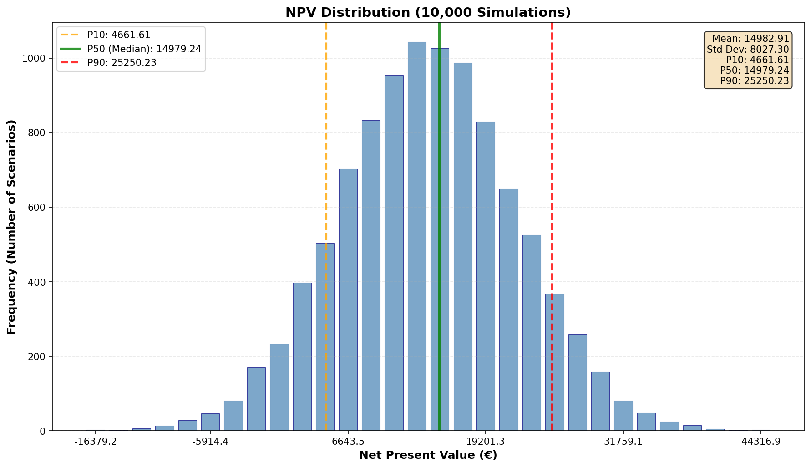
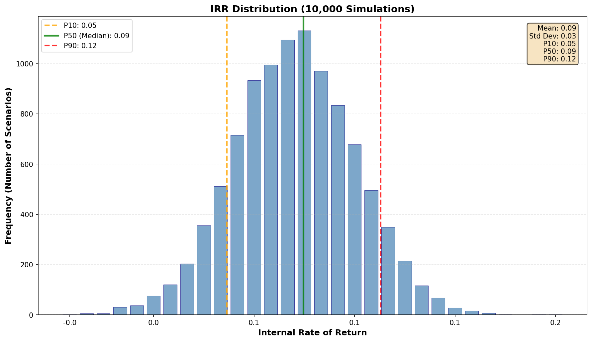
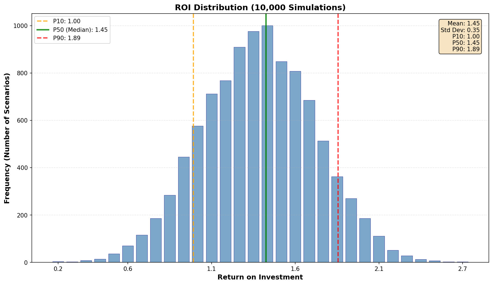
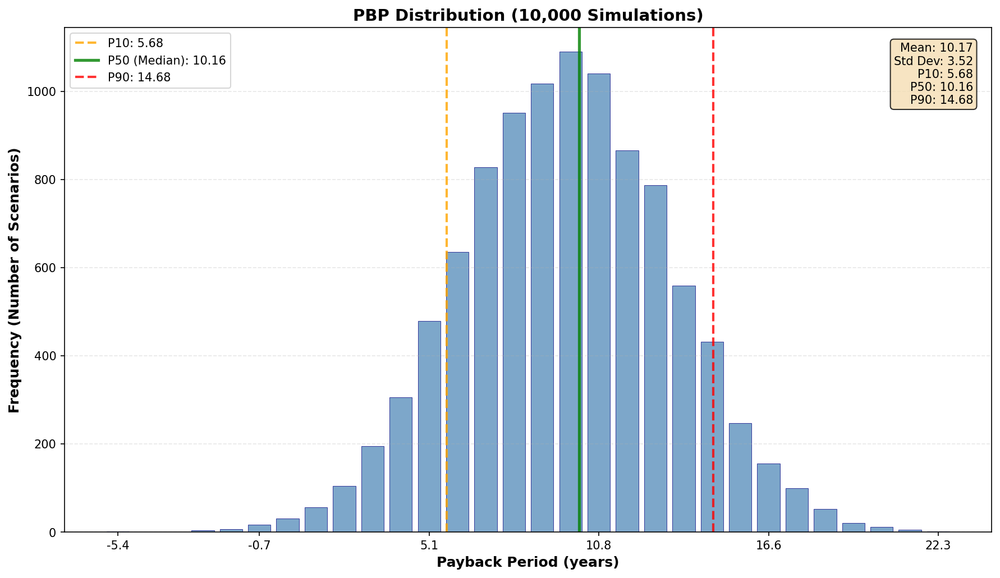
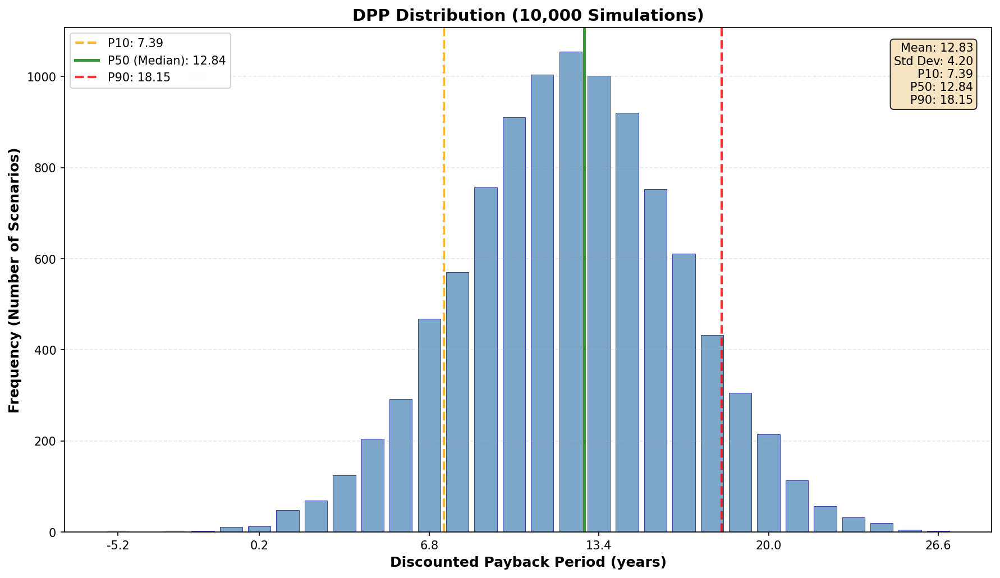
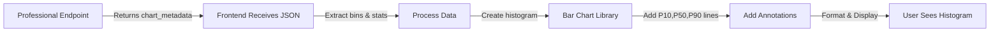

Endpoint Output Visualization Guide

This guide demonstrates how to render the distribution charts from the **Professional Output** of the risk assessment endpoint.

## Overview

The professional output includes `chart_metadata` containing all data needed to render distribution histograms client-side. This document shows:
- What the rendered charts look like
- The data structure of `chart_metadata`
- How to implement the frontend rendering

## Chart Metadata Structure

The professional endpoint returns data in this format:

```json
{
  "chart_metadata": {
    "NPV": {
      "bins": {
        "centers": [list of bin center values],
        "counts": [list of frequencies],
        "edges": [list of bin edge boundaries]
      },
      "statistics": {
        "mean": 15000.5,
        "std": 8000.2,
        "P10": 5000.3,
        "P50": 15000.5,
        "P90": 25000.7
      },
      "chart_config": {
        "xlabel": "Net Present Value (€)",
        "ylabel": "Frequency (Number of Scenarios)",
        "title": "NPV Distribution (10,000 Simulations)"
      }
    },
    "IRR": { ... },
    "ROI": { ... },
    "PBP": { ... },
    "DPP": { ... }
  }
}
```

## Rendered Visualizations

### Available Charts

The visualizations below show example outputs for each indicator:

| Indicator | File | Description |
|-----------|------|-------------|
| **NPV** | `distribution_npv.png` | Net Present Value distribution showing investment profitability  |
| **IRR** | `distribution_irr.png` | Internal Rate of Return distribution showing annualized return rates |
| **ROI** | `distribution_roi.png` | Return on Investment distribution as a multiple of investment |
| **PBP** | `distribution_pbp.png` | Payback Period distribution in years |
| **DPP** | `distribution_dpp.png` | Discounted Payback Period distribution in years |

Each chart shows:
- **Histogram bars**: Frequency distribution across 30 bins
- **Orange dashed line** (P10): 10th percentile
- **Green solid line** (P50): Median value
- **Red dashed line** (P90): 90th percentile
- **Statistics box**: Mean, std dev, and key percentiles

### Example Charts


*Figure 1: NPV Distribution - Shows the spread of net present value across 10,000 Monte Carlo simulations*


*Figure 2: IRR Distribution - Internal rate of return ranging from low-return to high-return scenarios*


*Figure 3: ROI Distribution - Return on investment as a multiplier of initial capital*


*Figure 4: Payback Period Distribution - Years required to break even on the investment*


*Figure 5: Discounted Payback Period - Break-even accounting for time value of money*

---

## Frontend Implementation Guide

### React/JavaScript Implementation Example

```javascript
import React from 'react';
import { Bar } from 'react-chartjs-2';
import {
  Chart as ChartJS,
  CategoryScale,
  LinearScale,
  BarElement,
  Title,
  Tooltip,
  Legend
} from 'chart.js';

ChartJS.register(
  CategoryScale,
  LinearScale,
  BarElement,
  Title,
  Tooltip,
  Legend
);

/**
 * Render a distribution histogram from professional output chart_metadata
 * 
 * @param {Object} chartData - Single chart_metadata entry (e.g., chartData.NPV)
 * @param {string} indicatorName - Indicator name (NPV, IRR, ROI, PBP, DPP)
 */
function DistributionChart({ chartData, indicatorName }) {
  const bins = chartData.bins;
  const stats = chartData.statistics;
  const config = chartData.chart_config;
  
  // Prepare data for histogram
  const binLabels = bins.centers.map((center, index) => 
    `${(bins.edges[index] + bins.edges[index + 1]) / 2 | 0}`
  );
  
  const data = {
    labels: binLabels,
    datasets: [
      {
        label: 'Frequency',
        data: bins.counts,
        backgroundColor: 'rgba(70, 130, 180, 0.7)',
        borderColor: 'rgba(0, 0, 128, 0.8)',
        borderWidth: 1,
      }
    ]
  };
  
  const options = {
    responsive: true,
    maintainAspectRatio: true,
    plugins: {
      legend: {
        display: true,
        position: 'top'
      },
      title: {
        display: true,
        text: config.title,
        font: { size: 14, weight: 'bold' }
      },
      annotation: {
        annotations: {
          P10: {
            type: 'line',
            xMin: stats.P10,
            xMax: stats.P10,
            borderColor: 'orange',
            borderDash: [5, 5],
            label: { content: [`P10: ${stats.P10.toFixed(2)}`] }
          },
          P50: {
            type: 'line',
            xMin: stats.P50,
            xMax: stats.P50,
            borderColor: 'green',
            label: { content: [`P50: ${stats.P50.toFixed(2)}`] }
          },
          P90: {
            type: 'line',
            xMin: stats.P90,
            xMax: stats.P90,
            borderColor: 'red',
            borderDash: [5, 5],
            label: { content: [`P90: ${stats.P90.toFixed(2)}`] }
          }
        }
      }
    },
    scales: {
      x: {
        title: {
          display: true,
          text: config.xlabel,
          font: { weight: 'bold' }
        }
      },
      y: {
        title: {
          display: true,
          text: config.ylabel,
          font: { weight: 'bold' }
        }
      }
    }
  };
  
  return (
    <div style={{ position: 'relative', width: '100%', height: '400px' }}>
      <Bar data={data} options={options} />
      <StatsBox stats={stats} />
    </div>
  );
}

/**
 * Display statistics in corner box
 */
function StatsBox({ stats }) {
  return (
    <div style={{
      position: 'absolute',
      top: 20,
      right: 20,
      backgroundColor: 'rgba(255, 228, 181, 0.8)',
      padding: '10px',
      borderRadius: '5px',
      fontSize: '12px',
      fontFamily: 'monospace'
    }}>
      <div>Mean: {stats.mean.toFixed(2)}</div>
      <div>Std Dev: {stats.std.toFixed(2)}</div>
      <div>P10: {stats.P10.toFixed(2)}</div>
      <div>P50: {stats.P50.toFixed(2)}</div>
      <div>P90: {stats.P90.toFixed(2)}</div>
    </div>
  );
}

export default DistributionChart;
```

### Data Flow



---

## Key Implementation Points

### 1. **Histogram Rendering**
- Use `bins.counts` for bar heights
- Use `bins.edges` or `bins.centers` for x-axis labels
- 30 bins provide smooth distribution visualization

### 2. **Percentile Lines**
- **P10 (Orange, dashed)**: Lower confidence bound
- **P50 (Green, solid)**: Median/expected value
- **P90 (Red, dashed)**: Upper confidence bound

### 3. **Statistics Box**
- Display `mean` and `std` for distribution overview
- Show P10, P50, P90 for quick reference
- Position in upper-right corner for visibility

### 4. **Responsive Design**
- Charts should resize with window
- Handle different screen sizes
- Maintain aspect ratio for readability

### 5. **Accessibility**
- Include alt text for images
- Label axes clearly using `chart_config.xlabel`, `ylabel`
- Use distinct colors for percentile lines (contrast ratio ≥ 4.5:1)

---

## Sample Data Export

The script also generates `sample_chart_metadata.json` containing realistic sample data matching what the endpoint returns. Use this for:
- Frontend testing without backend
- Documentation
- UI development in isolation

---

## Chart Library Recommendations

| Library | Best For | Notes |
|---------|----------|-------|
| **Chart.js** (react-chartjs-2) | Simple histograms | Lightweight, widely used |
| **Plotly.js** | Interactive charts | Annotations, zooming, hover |
| **D3.js** | Custom visualizations | Full control, steep learning curve |
| **Apache ECharts** | Advanced analytics | Rich features, good performance |

---

## Performance Considerations

- **Bin Count**: Fixed at 30 bins balances smoothness vs. file size
- **Data Size**: ~4-8 KB per indicator (small enough for real-time display)
- **Total Response**: ~20-40 KB for all 5 indicators
- **Rendering**: Client-side rendering is very fast (histogram drawing)

---

## Error Handling

If `chart_metadata` contains no finite values (rare edge case):
- Empty `bins.counts` and `bins.edges`
- `statistics` values are 0.0
- Display "Distribution unavailable" message
- Proceed with other visualizations

---

## Real Data Integration

To use actual endpoint data:

```javascript
async function fetchAndRenderCharts(projectParams) {
  const response = await fetch('/risk-assessment', {
    method: 'POST',
    headers: { 'Content-Type': 'application/json' },
    body: JSON.stringify({
      ...projectParams,
      output_level: 'professional'  // Request professional output
    })
  });
  
  const result = await response.json();
  const { chart_metadata } = result.metadata;
  
  // Render each indicator's chart
  Object.entries(chart_metadata).forEach(([indicator, chartData]) => {
    const container = document.getElementById(`chart-${indicator}`);
    renderDistributionChart(chartData, indicator, container);
  });
}
```

---

## Related Documentation

- [Risk Assessment API Documentation](../PROFESSIONAL_OUTPUT_DOCUMENTATION.md)
- [Output Level Specifications](../PRIVATE_VS_PROFESSIONAL_OUTPUT.md)
- [Indicator Definitions](../API_USER_INPUTS.md)
