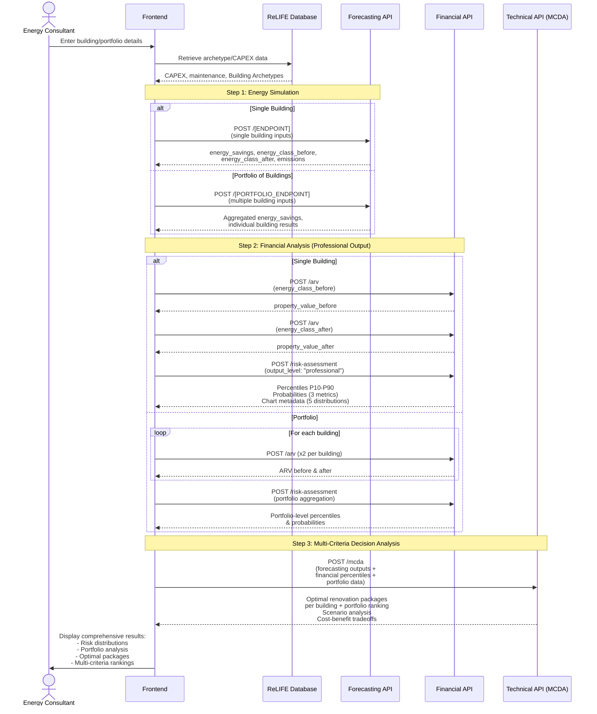
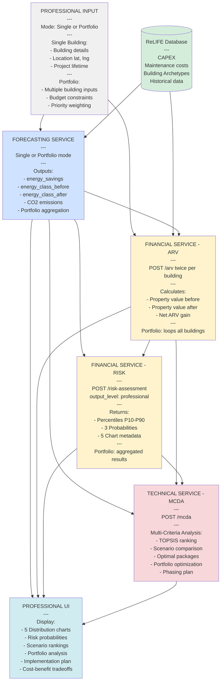

# ReLIFE PRA Tool - API Flow Diagram

**Professional Risk Assessment (PRA)**

This document shows the sequence of API calls needed to implement the PRA tool.

> **Note:** This tool is based on the HRA (Home Renovation Advisor) tool but designed specifically for **energy consultants, advisors, and professionals**. See [ReLIFE_HMA_flowchart.md](./ReLIFE_HMA_flowchart.md) for the private homeowner version.

---

## Key Differences: PRA vs HRA

| Feature | HRA (Private) | PRA (Professional) |
|---------|---------------|-------------------|
| **Target Audience** | Individual homeowners | Energy consultants, advisors |
| **Output Detail** | Simplified, actionable insights | Detailed risk analysis |
| **API Output Level** | `output_level: "private"` | `output_level: "professional"` |
| **Financial Metrics** | P10-P90 percentiles + MonthlyAvgSavings + SuccessRate | P10-P90 percentiles only |
| **Probability Metrics** | Simple SuccessRate | 3 detailed probabilities: Pr(NPV>0), Pr(PBP<lifetime), Pr(DPP<lifetime) |
| **Visualization Data** | Cash flow timeline (1 chart) | Distribution histograms (5 charts: NPV, IRR, ROI, PBP, DPP) |
| **Portfolio Analysis** | ❌ Single building only | ✅ Single building **OR** portfolio of buildings |
| **Technical Ranking** | Basic optimal package | Advanced multi-criteria decision analysis (MCDA) |
| **Response Size** | ~10-12 KB | ~18-25 KB |

---

## API Call Flow



---

## 1. User Inputs

### Portfolio Mode Support

The PRA tool supports two modes:

1. **Single Building Analysis** - Same inputs as HRA, but with professional-level outputs
2. **Portfolio Analysis** - Analyze multiple buildings simultaneously with aggregated results

#### Portfolio-Specific Inputs

When analyzing a portfolio, the following additional structure is used:

```json
{
  "analysis_mode": "portfolio",  // "single" or "portfolio"
  "buildings": [
    {
      "building_id": "BLD-001",
      "name": "Office Building A",
      // ... standard building inputs for Forecasting API ...
    },
    {
      "building_id": "BLD-002", 
      "name": "Apartment Complex B",
      // ... standard building inputs ...
    }
  ],
  "portfolio_constraints": {
    "total_budget": 500000,  // Total CAPEX budget across all buildings
    "implementation_phasing": true,  // Allow multi-year implementation
    "priority_weighting": {
      "financial_roi": 0.4,
      "energy_savings": 0.3,
      "emissions_reduction": 0.2,
      "social_impact": 0.1
    }
  }
}
```

---

### Forecasting API

**Required Inputs:** *(Same as HRA - see [ReLIFE_HMA_flowchart.md](./ReLIFE_HMA_flowchart.md) for complete details)*

#### Building
- `name`, `azimuth_relative_to_true_north`, `latitude`, `longitude`
- `exposed_perimeter`, `height`, `wall_thickness`, `n_floors`
- `building_type_class`, `net_floor_area`

#### Envelope Elements: `"building_surface"`
- Surface definitions (opaque, transparent, adiabatic, adjacent)
- Common attributes: `area`, `u_value`, `orientation`, `thermal_capacity`
- Transparent surface attributes: `g_value`, `shading`, window dimensions

#### System Parameters
- Emitter block, Distribution block, Generator block
- Control strategies, Efficiency models

**Portfolio Mode:**
- When `analysis_mode: "portfolio"`, Forecasting API processes multiple buildings
- Returns individual results + aggregated portfolio metrics

---

### Financial API

**Required Inputs from User:**
- `project_lifetime` (int, 1-30 years)
- Property location: `lat`, `lng`
- Property details: `floor_area`, `construction_year`, `number_of_floors`, `property_type`

**Optional Inputs from User:**
- `capex` (float) - If not provided, retrieved from database
- `annual_maintenance_cost` (float) - If not provided, retrieved from database  
- `loan_amount` (float, default: 0.0)
- `loan_term` (int, default: 0)
- `floor_number` (int, default: null)
- `renovated_last_5_years` (bool, default: true)

**Frontend-Defined Inputs:**
- `output_level` (string) - **Automatically set to `"professional"`** for PRA tool
  - HRA tool uses `"private"`
  - PRA tool uses `"professional"` ← **Key Difference**
  
**Portfolio Mode:**
- `analysis_mode: "portfolio"` (optional, triggers portfolio aggregation)
- `building_ids: []` (array of building IDs being analyzed)

**Data from ReLIFE Database:**
- `capex` (when not provided by user)
- `annual_maintenance_cost` (when not provided by user)

---

### Technical API (MCDA)

**Required Inputs:**
- Financial percentiles (NPV, IRR, ROI, PBP, DPP) at P10-P90
- Success probabilities from Financial API
- Energy performance metrics from Forecasting API
- Environmental impact data (CO2, emissions)

**Portfolio-Specific Inputs:**
- Building-level results for each property in portfolio
- Budget constraints and phasing requirements
- Priority weighting matrix

**Outputs:**
- Ranked renovation scenarios using TOPSIS/AHP
- Optimal technology packages per building
- Portfolio-level recommendations
- Cost-benefit tradeoff analysis
- Implementation phasing plan (for portfolios)

---

## 2. API Endpoints & Data Flow

### Forecasting API

**Endpoint:** `POST /[TO_BE_DEFINED]`

**Single Building Mode:**
```json
{
  // Standard building inputs (see HRA documentation)
}
```

**Portfolio Mode:**
```json
{
  "analysis_mode": "portfolio",
  "buildings": [
    { "building_id": "BLD-001", /* ... building 1 inputs ... */ },
    { "building_id": "BLD-002", /* ... building 2 inputs ... */ }
  ]
}
```

**Outputs:**
- `annual_energy_savings` (float, kWh/year) - Required by Financial API
- `energy_class_before` (string, EPC label before renovation)
- `energy_class_after` (string, EPC label after renovation) - Required by Financial API
- `co2_emissions_before` (float, kg CO2/year)
- `co2_emissions_after` (float, kg CO2/year)
- `co2_reduction` (float, kg CO2/year)

**Portfolio Mode Outputs:**
```json
{
  "portfolio_summary": {
    "total_energy_savings": 450000,  // kWh/year across all buildings
    "total_co2_reduction": 120000,   // kg CO2/year
    "average_energy_class_improvement": 2.3  // EPC class levels
  },
  "buildings": [
    {
      "building_id": "BLD-001",
      "annual_energy_savings": 180000,
      "energy_class_before": "E",
      "energy_class_after": "B+",
      // ... individual results ...
    },
    // ... more buildings ...
  ]
}
```

---

### Financial API

#### POST `/arv` - After Renovation Value

**Usage in PRA:** Called **twice per building** to calculate value increase:
1. First call with `energy_class_before` → baseline property value
2. Second call with `energy_class_after` → renovated property value
3. Calculate ARV net gain: `property_value_after - property_value_before`

**Input Example:**
```json
{
  "lat": 37.981,
  "lng": 23.728,
  "floor_area": 85.0,
  "construction_year": 1985,
  "number_of_floors": 5,
  "property_type": "Apartment",
  "floor_number": 2,
  "energy_class": "B+",  // FROM FORECASTING API (before OR after)
  "renovated_last_5_years": true
}
```

**Output Example:**
```json
{
  "price_per_sqm": 1235.50,
  "total_price": 105017.50
}
```

**Portfolio Mode:**
- Frontend calls `/arv` twice for each building in portfolio
- Aggregates total portfolio value increase

---

#### POST `/risk-assessment` - Professional Risk Analysis

**Key Difference from HRA:** `output_level: "professional"` instead of `"private"`

**Input Example:**
```json
{
  "annual_energy_savings": 27400,  // FROM FORECASTING API
  "project_lifetime": 20,
  "output_level": "professional",  // ← SET BY FRONTEND (automatic for PRA)
  "capex": 60000,
  "annual_maintenance_cost": 2000,
  "loan_amount": 25000,
  "loan_term": 15,
  "indicators": ["IRR", "NPV", "PBP", "DPP", "ROI"]  // All 5 for professional output
}
```

**Output Example (Professional Level):**
```json
{
  "point_forecasts": {
    "NPV": 5432.10,
    "IRR": 5.7,
    "ROI": 15.2,
    "PBP": 8.3,
    "DPP": 10.1
    // NOTE: NO "MonthlyAvgSavings" or "SuccessRate" (those are private-level only)
  },
  "percentiles": {
    "NPV": {
      "P10": 2100, "P20": 3200, "P30": 4100, "P40": 4800,
      "P50": 5432, "P60": 6100, "P70": 6900, "P80": 7800, "P90": 9800
    },
    "IRR": {
      "P10": 3.1, "P20": 4.0, "P30": 4.6, "P40": 5.2,
      "P50": 5.7, "P60": 6.3, "P70": 7.0, "P80": 7.9, "P90": 8.9
    },
    "ROI": { /* P10-P90 */ },
    "PBP": { /* P10-P90 */ },
    "DPP": { /* P10-P90 */ }
  },
  "probabilities": {
    "Pr(NPV > 0)": 0.8435,           // Probability of profitability
    "Pr(PBP < 20y)": 0.9124,         // Probability of simple payback within lifetime
    "Pr(DPP < 20y)": 0.7563          // Probability of discounted payback within lifetime
  },
  "metadata": {
    "n_sims": 10000,
    "project_lifetime": 20,
    "capex": 60000,
    "annual_maintenance_cost": 2000,
    "annual_energy_savings": 27400,
    "loan_amount": 25000,
    "loan_term": 15,
    "discount_rate": 0.06,
    "output_level": "professional",
    "indicators_requested": ["IRR", "NPV", "PBP", "DPP", "ROI"],
    
    // ═══════════════════════════════════════════════════════
    // KEY DIFFERENCE: chart_metadata instead of cash_flow_data
    // ═══════════════════════════════════════════════════════
    "chart_metadata": {
      "NPV": {
        "bins": {
          "centers": [1200, 1450, 1700, /* ... 30 bins ... */, 12500],
          "counts": [45, 123, 289, /* ... */, 67],
          "edges": [1075, 1325, 1575, /* ... */, 12625]
        },
        "statistics": {
          "mean": 5500.0,
          "std": 2300.0,
          "P10": 2100.0,
          "P50": 5432.1,
          "P90": 9800.0
        },
        "chart_config": {
          "xlabel": "Net Present Value (€)",
          "ylabel": "Frequency (Number of Scenarios)",
          "title": "NPV Distribution (10,000 Simulations)"
        }
      },
      "IRR": { /* same structure */ },
      "ROI": { /* same structure */ },
      "PBP": { /* same structure */ },
      "DPP": { /* same structure */ }
    }
  }
}
```

**Portfolio Mode Input:**
```json
{
  "analysis_mode": "portfolio",
  "buildings": [
    {
      "building_id": "BLD-001",
      "annual_energy_savings": 180000,
      "capex": 250000,
      // ... other parameters ...
    },
    {
      "building_id": "BLD-002",
      "annual_energy_savings": 120000,
      "capex": 180000,
      // ... other parameters ...
    }
  ],
  "project_lifetime": 20,
  "output_level": "professional",
  "portfolio_budget": 500000,
  "indicators": ["IRR", "NPV", "PBP", "DPP", "ROI"]
}
```

**Portfolio Mode Output:**
```json
{
  "portfolio_summary": {
    "point_forecasts": {
      "NPV": 145320.50,  // Aggregated across all buildings
      "IRR": 6.8,
      "ROI": 18.5,
      "PBP": 7.2,
      "DPP": 9.1
    },
    "percentiles": { /* Aggregated P10-P90 */ },
    "probabilities": { /* Portfolio-level probabilities */ }
  },
  "building_results": [
    {
      "building_id": "BLD-001",
      "point_forecasts": { /* Individual building results */ },
      "percentiles": { /* Individual P10-P90 */ },
      "probabilities": { /* Individual probabilities */ },
      "metadata": {
        "chart_metadata": { /* 5 distribution charts */ }
      }
    },
    // ... more buildings ...
  ]
}
```

---

### Technical API (Multi-Criteria Decision Analysis)

**Endpoint:** `POST /mcda`

**Input Example:**
```json
{
  "analysis_mode": "single",  // or "portfolio"
  "financial_results": {
    "percentiles": { /* NPV, IRR, ROI, PBP, DPP distributions */ },
    "probabilities": { /* 3 success metrics */ }
  },
  "energy_results": {
    "annual_savings": 27400,
    "energy_class_before": "E",
    "energy_class_after": "B+",
    "co2_reduction": 8500
  },
  "criteria_weights": {
    "financial_roi": 0.4,
    "energy_savings": 0.3,
    "emissions_reduction": 0.2,
    "implementation_complexity": 0.1
  },
  "renovation_scenarios": [
    {
      "scenario_id": "SC-001",
      "name": "Envelope + HVAC",
      "technologies": ["wall_insulation", "window_replacement", "heat_pump"],
      "capex": 60000,
      "energy_savings": 27400
    },
    {
      "scenario_id": "SC-002",
      "name": "PV + Storage",
      "technologies": ["solar_pv", "battery_storage"],
      "capex": 45000,
      "energy_savings": 18200
    }
    // ... more scenarios ...
  ]
}
```

**Output Example:**
```json
{
  "optimal_scenario": {
    "scenario_id": "SC-001",
    "name": "Envelope + HVAC",
    "topsis_score": 0.8745,
    "rank": 1,
    "justification": {
      "financial_score": 0.92,
      "energy_score": 0.88,
      "emissions_score": 0.91,
      "complexity_score": 0.75
    }
  },
  "scenario_rankings": [
    {
      "rank": 1,
      "scenario_id": "SC-001",
      "topsis_score": 0.8745,
      "sensitivity_analysis": {
        "robust_under_price_variation": true,
        "risk_adjusted_score": 0.8521
      }
    },
    {
      "rank": 2,
      "scenario_id": "SC-002",
      "topsis_score": 0.7832
    }
    // ... more scenarios ...
  ],
  "criteria_matrix": {
    "Financial": [0.92, 0.78, 0.65, /* ... */],
    "Environmental": [0.91, 0.95, 0.72, /* ... */],
    "Economic": [0.88, 0.81, 0.79, /* ... */],
    "Social": [0.75, 0.82, 0.88, /* ... */]
  },
  "decision_support": {
    "best_for_roi": "SC-001",
    "best_for_emissions": "SC-002",
    "best_for_quick_payback": "SC-003",
    "recommended": "SC-001",
    "confidence_level": "high"
  }
}
```

**Portfolio Mode Output:**
```json
{
  "portfolio_optimization": {
    "total_budget_used": 485000,
    "total_budget_available": 500000,
    "buildings_prioritized": [
      {
        "building_id": "BLD-001",
        "priority_rank": 1,
        "allocated_budget": 250000,
        "expected_roi": 19.5,
        "implementation_year": 1,
        "optimal_scenario": "SC-001"
      },
      {
        "building_id": "BLD-002",
        "priority_rank": 2,
        "allocated_budget": 235000,
        "expected_roi": 16.8,
        "implementation_year": 1,
        "optimal_scenario": "SC-003"
      }
    ],
    "phasing_plan": {
      "year_1": ["BLD-001", "BLD-002"],
      "year_2": ["BLD-003"],
      "year_3": []
    },
    "portfolio_metrics": {
      "total_energy_savings": 450000,
      "total_co2_reduction": 120000,
      "portfolio_npv": 145320,
      "portfolio_irr": 6.8,
      "payback_period": 7.2
    }
  }
}
```

---

## 3. Professional Output Visualization

### Distribution Charts (5 charts)

The professional output provides **histogram metadata** for client-side rendering of 5 distribution charts:

1. **NPV Distribution** - Net Present Value outcomes
2. **IRR Distribution** - Internal Rate of Return spread
3. **ROI Distribution** - Return on Investment variability
4. **PBP Distribution** - Simple Payback Period range
5. **DPP Distribution** - Discounted Payback Period uncertainty

Each chart displays:
- Histogram of 10,000 Monte Carlo simulation results
- Vertical lines at P10 (pessimistic), P50 (median), P90 (optimistic)
- Mean and standard deviation statistics
- Risk/uncertainty visualization

**Chart Rendering Example (Chart.js):**
```javascript
const chartData = response.metadata.chart_metadata.NPV;

new Chart(ctx, {
  type: 'bar',
  data: {
    labels: chartData.bins.centers,
    datasets: [{
      label: 'Frequency',
      data: chartData.bins.counts,
      backgroundColor: 'rgba(54, 162, 235, 0.6)'
    }]
  },
  options: {
    plugins: {
      title: { text: chartData.chart_config.title },
      annotation: {
        annotations: {
          p10: {
            type: 'line',
            xMin: chartData.statistics.P10,
            xMax: chartData.statistics.P10,
            borderColor: 'red',
            label: { content: 'P10 (Pessimistic)' }
          },
          p50: {
            type: 'line',
            xMin: chartData.statistics.P50,
            xMax: chartData.statistics.P50,
            borderColor: 'orange',
            label: { content: 'P50 (Expected)' }
          },
          p90: {
            type: 'line',
            xMin: chartData.statistics.P90,
            xMax: chartData.statistics.P90,
            borderColor: 'green',
            label: { content: 'P90 (Optimistic)' }
          }
        }
      }
    }
  }
});
```

---

## 4. Frontend Implementation

### Sequential Flow



---

## 5. Key Implementation Notes

### Automatic Output Level Detection

The frontend **automatically sets** `output_level` based on the tool:
- **HRA tool** → `output_level: "private"`
- **PRA tool** → `output_level: "professional"`

**Users never select this manually** - it's determined by which tool they're using.

### Portfolio Aggregation Strategy

When analyzing a portfolio:

1. **Forecasting API** returns individual + aggregated energy results
2. **Financial API** processes each building separately for ARV
3. **Financial API** aggregates risk assessment at portfolio level
4. **Technical API** performs portfolio-wide optimization considering:
   - Budget constraints
   - Implementation dependencies
   - Priority weighting
   - Multi-year phasing

### Response Size Considerations

- **Single Building (Professional):** ~18-25 KB
  - Larger than HRA due to chart metadata (5 distributions × 30 bins each)
  
- **Portfolio (3-5 Buildings):** ~80-120 KB
  - Scales with number of buildings
  - Each building includes full chart metadata
  - Portfolio-level aggregations add overhead

### Visualization Differences

| Output Level | HRA (Private) | PRA (Professional) |
|--------------|---------------|-------------------|
| Cash Flow Timeline | ✅ 1 chart (years vs cumulative cash flow) | ❌ Not included |
| Distribution Histograms | ❌ Not included | ✅ 5 charts (NPV, IRR, ROI, PBP, DPP) |
| Metadata Field | `cash_flow_data` | `chart_metadata` |
| Chart Type | Line/area chart | Histogram with percentile lines |
| Frontend Rendering | Simple timeline plot | Statistical distributions with P10/P50/P90 |

---

## 6. Related Documentation

- **[ReLIFE_HMA_flowchart.md](./ReLIFE_HMA_flowchart.md)** - Private homeowner version (HRA tool)
- **[PRIVATE_VS_PROFESSIONAL_OUTPUT.md](../PRIVATE_VS_PROFESSIONAL_OUTPUT.md)** - Detailed comparison of output levels
- **[PROFESSIONAL_OUTPUT_DOCUMENTATION.md](../PROFESSIONAL_OUTPUT_DOCUMENTATION.md)** - Complete professional API guide
- **[CASH_FLOW_CHART_METADATA.md](../CASH_FLOW_CHART_METADATA.md)** - Private output visualization guide
- **[Risk_Assessment_Documentation.md](../Risk_Assessment_Documentation.md)** - Monte Carlo methodology

---

**Last Updated:** February 5, 2026  
**Version:** 1.0  
**Tool:** Professional Risk Assessment (PRA)
