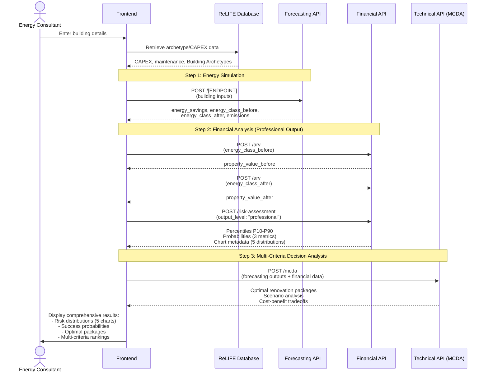
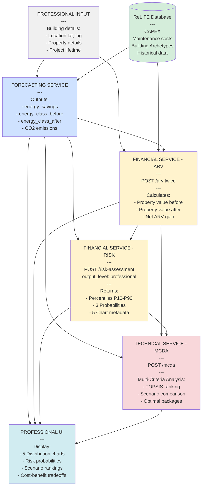

# ReLIFE PRA Tool - API Flow Diagram

**Professional Risk Assessment (PRA)**

This document shows the API flow for the PRA tool for professional consultants.

> **Main Difference from HMA:** The PRA tool uses `output_level: "professional"` for the Financial API (automatically set by frontend) to receive detailed risk distributions and chart metadata, while HMA uses `output_level: "private"` for simplified homeowner outputs.

> **See Also:** [ReLIFE_HMA_flowchart.md](./ReLIFE_HMA_flowchart.md) for the homeowner version (HMA).

---

## Output Level Comparison by API

### Financial API

| Aspect | HMA (Private) | PRA (Professional) |
|--------|---------------|-------------------|
| **Output Level** | `"private"` | `"professional"` |
| **Target Users** | Homeowners | Energy consultants, advisors |
| **Percentiles** | P10-P90 for all indicators | P10-P90 for all indicators |
| **Success Metrics** | MonthlyAvgSavings, SuccessRate | 3 Probabilities (NPV>0, PBP<lifetime, DPP<lifetime) |
| **Visualization** | cash_flow_data (1 timeline chart) | chart_metadata (5 distribution histograms) |
| **Response Size** | ~10 KB | ~20 KB |

For detailed comparison, see [PRIVATE_VS_PROFESSIONAL_OUTPUT.md](../PRIVATE_VS_PROFESSIONAL_OUTPUT.md).

### Forecasting API

> **To be defined by Daniele**

### Technical API

> **To be defined by Eric**

---
## API Call Flow



---

## 1. API Component Inputs & Outputs

### Forecasting API

> **To be revised by Daniele**  
> 
> See [ReLIFE_HMA_flowchart.md](./ReLIFE_HMA_flowchart.md) for current Forecasting API structure.

---

### Financial API

**All inputs and outputs are identical to HMA** - see [ReLIFE_HMA_flowchart.md](./ReLIFE_HMA_flowchart.md) for complete Financial API documentation (/arv and /risk-assessment endpoints).

**Key Difference:**
- **HMA tool:** `output_level: "private"` (automatically set by frontend)
- **PRA tool:** `output_level: "professional"` (automatically set by frontend)

This is the **only difference** between HMA and PRA for the Financial API. The `output_level` parameter determines the response structure:
- **Private:** Returns `cash_flow_data` (for timeline chart), `MonthlyAvgSavings`, `SuccessRate`
- **Professional:** Returns `chart_metadata` (for 5 distribution charts), `probabilities` (3 success metrics)

Both return `percentiles` (P10-P90) for all requested indicators.

---

### Technical API (Multi-Criteria Decision Analysis)

> **To be revised by Eric**  
> 
> Technical API documentation for PRA tool will be provided.

---

## 2. Professional Output Visualization

### Distribution Charts (5 charts)

The professional output provides **histogram metadata** for client-side rendering of 5 distribution charts:

1. **NPV Distribution** - Net Present Value outcomes
2. **IRR Distribution** - Internal Rate of Return spread
3. **ROI Distribution** - Return on Investment variability
4. **PBP Distribution** - Simple Payback Period range
5. **DPP Distribution** - Discounted Payback Period uncertainty

Each chart displays:
- Histogram of 10,000 Monte Carlo simulation results
- Vertical lines at P10 (pessimistic), P50 (median), P90 (optimistic)
- Mean and standard deviation statistics
- Risk/uncertainty visualization

**Chart Rendering Example (Chart.js):**
```javascript
const chartData = response.metadata.chart_metadata.NPV;

new Chart(ctx, {
  type: 'bar',
  data: {
    labels: chartData.bins.centers,
    datasets: [{
      label: 'Frequency',
      data: chartData.bins.counts,
      backgroundColor: 'rgba(54, 162, 235, 0.6)'
    }]
  },
  options: {
    plugins: {
      title: { text: chartData.chart_config.title },
      annotation: {
        annotations: {
          p10: {
            type: 'line',
            xMin: chartData.statistics.P10,
            xMax: chartData.statistics.P10,
            borderColor: 'red',
            label: { content: 'P10 (Pessimistic)' }
          },
          p50: {
            type: 'line',
            xMin: chartData.statistics.P50,
            xMax: chartData.statistics.P50,
            borderColor: 'orange',
            label: { content: 'P50 (Expected)' }
          },
          p90: {
            type: 'line',
            xMin: chartData.statistics.P90,
            xMax: chartData.statistics.P90,
            borderColor: 'green',
            label: { content: 'P90 (Optimistic)' }
          }
        }
      }
    }
  }
});
```

---

## 4. Frontend Implementation

### Sequential Flow



---

## 5. Key Implementation Notes

### Automatic Output Level Detection

The frontend **automatically sets** `output_level` for the Financial API based on the tool:
- **HRA tool** → `output_level: "private"`
- **PRA tool** → `output_level: "professional"`

**Users never select this manually** - it's determined by which tool they're using.

### Response Size Considerations

- **Professional output:** ~18-25 KB
  - Larger than private output due to chart metadata (5 distributions × 30 bins each)

### Visualization Differences

| Output Level | HRA (Private) | PRA (Professional) |
|--------------|---------------|-------------------|
| Cash Flow Timeline | ✅ 1 chart (years vs cumulative cash flow) | ❌ Not included |
| Distribution Histograms | ❌ Not included | ✅ 5 charts (NPV, IRR, ROI, PBP, DPP) |
| Metadata Field | `cash_flow_data` | `chart_metadata` |
| Chart Type | Line/area chart | Histogram with percentile lines |
| Frontend Rendering | Simple timeline plot | Statistical distributions with P10/P50/P90 |

---

## 6. Related Documentation

- **[ReLIFE_HMA_flowchart.md](./ReLIFE_HMA_flowchart.md)** - Private homeowner version (HRA tool)
- **[PRIVATE_VS_PROFESSIONAL_OUTPUT.md](../PRIVATE_VS_PROFESSIONAL_OUTPUT.md)** - Detailed comparison of output levels
- **[PROFESSIONAL_OUTPUT_DOCUMENTATION.md](../PROFESSIONAL_OUTPUT_DOCUMENTATION.md)** - Complete professional API guide
- **[CASH_FLOW_CHART_METADATA.md](../CASH_FLOW_CHART_METADATA.md)** - Private output visualization guide
- **[Risk_Assessment_Documentation.md](../Risk_Assessment_Documentation.md)** - Monte Carlo methodology

---

**Last Updated:** February 5, 2026  
**Version:** 1.0  
**Tool:** Professional Risk Assessment (PRA)
